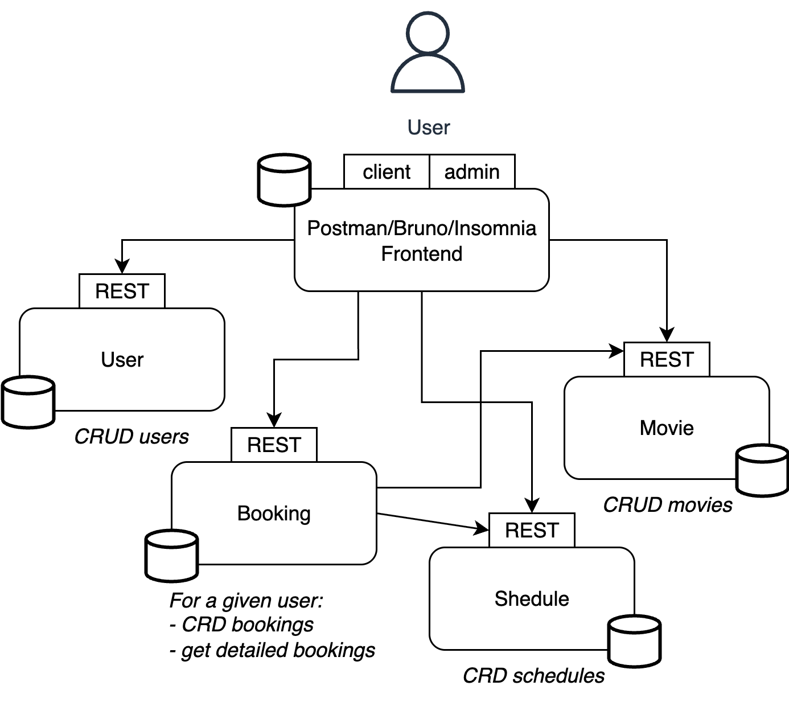

# Architecture générale

# Voici les 4 services :

| Service | Rôle | Port |
|--------|------|-------|
| **User** | Authentification & gestion des utilisateurs | `3004` |
| **Movie** | Gestion des films du cinéma | `3001` |
| **Schedule** | Gestion des jours de passage des films dans le cinéma | `3003` |
| **Booking** | Réservation des films par les utilisateurs | `3002` |

Chaque service dispose de :
- une documentation `.yaml` qui détaille les routes disponibles
- une table dédiée dans la base MongoDB globale, dans un conteneur Docker (voir plus loin)
- un fichier JSON local pour l’initialisation (`databases/*.json`)

# Système d'authentification

### Authentification centralisée via le service **User**

Toutes les requêtes vers les services doivent inclure le header **X-Token**. C'est une clé d'accès personnelle pour chaque utilisateur.

On vérifie :
- la validité du token (qu'un utilisateur correspond)
- le **niveau de permission** (`user` ou `admin`) si un niveau de permission doit être vérifié

# Docker

Chaque service dispose d'un `Dockerfile` pour créer le conteneur correspondant.

Un fichier `docker-compose.yml` permet de créer l'ensemble des conteneurs, y compris un conteneur contenant la base de données MongoDB.

# Déploiement / Utilisation

### Utilisation via Docker

- S'assurer que la variable d'environnement `MODE` dans le fichier `.env` est à `DOCKER`
- Se placer dans le dossier dans un terminal et exécuter la commande `docker-compose up --build`
- Importer le fichier `Routes_REST.yaml` dans Insomnia pour utiliser les APIs

### Utilisation locale

- S'assurer que la variable d'environnement `MODE` dans le fichier `.env` est à `LOCAL`
- Disposer d'un conteneur MongoDB sur le port 3000
- Créer un environnement vrituel python
   - `python3 -m venv venv`
   - `venv/Scripts/activate`
   - `pip3 install -r requirements.txt`
- Lancer les services un par un dans des terminaux distints
   - `cd user`
   - `python3 user.py`
   - Et de même pour `movie`, `booking` et `schedule`
- Importer le fichier `Routes_REST.yaml` dans Insomnia pour utiliser les APIs